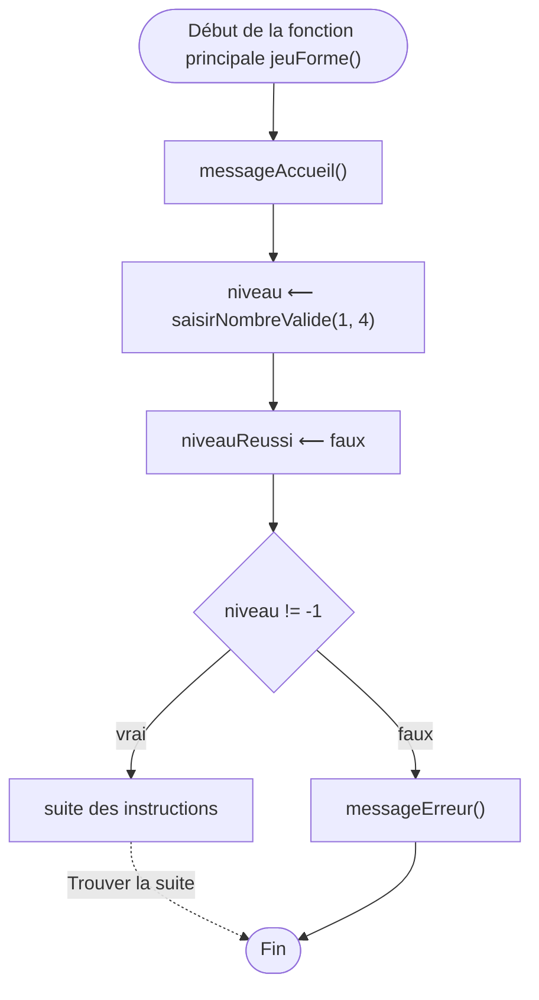

# Jeu : Révision géométrique

## ÉTAPE 1 : Descriptif

Écrire le code d'un jeu permettant à un élève de primaire de réviser son cours sur les formes géométriques.

- Après un message d'accueil, l'élève choisit un niveau de difficulté parmi 4. Si le choix n'est pas 1, 2, 3 ou 4 alors le jeu est terminé.
- En fonction de sa réponse, une forme prédéfinie lui est montrée. 
    * niveau 1 : un carré 3X3 {: style="height:50px;width:50px"}
    * niveau 2 : un carré 5X5 {: style="height:50px;width:50px"}
    * niveau 3 : un triangle rectangle de hauteur 2 {: style="height:50px;width:50px"}
    * niveau 4 : un triangle isocèle de hauteur 4 {: style="height:50px;width:50px"}
- Une première question est posée à l'élève. Est-ce un carré ou un triangle ? Si la réponse est mauvaise, l'élève en est informé et le jeu s'arrête. Sinon une seconde question lui est posée.
- Seconde question : quelle est la surface de cette forme géométrique ?
- Si la réponse est mauvaise (ou pas dans la liste des propositions), l'élève en est informé et le jeu s'arrête. Sinon l'élève est félicité pour la réussite de ce niveau. 
- Le jeu se termine.
- Il faut relancer le jeu pour pouvoir faire un autre niveau.

Ci-dessous une vidéo illustrant quelques exemples de ce qui est attendu.


## ÉTAPE 2 : Analyse

### ÉTAPE 2.1 : Identification des fonctions

On ne code pas directement une solution logicielle. Une étape préalable consiste à déterminer quelles seront les grandes fonctionnalités de votre code. 

Pour ce cycle 0, nous vous aidons en vous fournissant les fonctions à créer (ce ne sera plus le cas dans les prochains cycles).
Pour ce cycle 0, le contenu de la fonction **afficheLigne(E car : caractère, E min : entier, E taille : entier)** n'est pas à écrire. Il faut simplement comprendre comment on l'utilise.

Lisez la documentation de chaque fonction ci-dessous :

---
``` { .exalgo use_pygments=false }
Fonction jeuForme()
```
Fonction principale du programme.
Permet d'appeler les autres fonctions et d'afficher 
les résultats en fonction de ce qu'elles retournent.

---
``` { .exalgo use_pygments=false }
Fonction jouerUnNiveau(E niveau : entier) : booléen
```
Fonction qui permet de jouer un niveau dont la valeur
est passée en paramètre.
Retourne `vrai` si le niveau est réussi, `faux` sinon.

---
``` { .exalgo use_pygments=false }
Fonction saisirNombre() : entier
```
Demande la saisie d'un nombre, et retourne l'entier saisi au clavier.

---
``` { .exalgo use_pygments=false }
Fonction saisirCaractere() : caractère
```
Demande la saisie d'un caractère, et retourne le caractère saisi au clavier.  

---
``` { .exalgo use_pygments=false }
Fonction saisirNombreValide(E min : entier, E max : entier) : entier
```
Demande à un utilisateur de saisir un nombre entre `min` et `max` (inclus).
Retourne `-1` si le nombre n'est pas dans l'intervalle souhaité.

---
``` { .exalgo use_pygments=false }
Fonction afficherFormeNiveau(E niveau : entier)
```
Affiche la forme en fonction du niveau.

---
``` { .exalgo use_pygments=false }
Fonction surfaceCorrecte(E niveau : entier) : entier
```
Surface correcte de chaque niveau (renvoie -1 si le niveau n'est pas correct).
Par exemple `surfaceCorrecte(1)` renvoie `9`.

---
``` { .exalgo use_pygments=false }
Fonction formeCorrecte(E niveau : entier) : caractère
```
Forme (`'c'`arré ou `'t'`riangle) correspondant à un niveau donné.
Par exemple :

- `formeCorrecte(1)` retourne `'c'`.
- `formeCorrecte(3)` retourne `'t'`.

---
``` { .exalgo use_pygments=false }
Fonction messageAccueil()
```
Affiche le message d'accueil du jeu.

---
``` { .exalgo use_pygments=false }
Fonction messageFinDeJeu(E niveauReussi : booléen, E niveau : entier)
```
Selon la valeur du paramètre `niveauReussi`, affiche un message
indiquant si le niveau passé en paramètre a été validé ou non.

---
``` { .exalgo use_pygments=false }
Fonction messageErreur() 
```
Affiche un message d'erreur si l'utilisateur saisit une valeur incorrecte
(ce qui provoque l'arrêt du programme).

---
``` { .exalgo use_pygments=false }
Fonction saisieReponseForme() : caractère
```
Affiche un message invitant à répondre (c)arré ou (t)riangle.
Retourne le caractère saisi.

---
``` { .exalgo use_pygments=false }
Fonction saisieReponseSurface() : entier
```
Affiche un message invitant à saisir une surface.
Retourne l'entier saisi.

---
``` { .exalgo use_pygments=false }
Fonction afficheLigne(E car : caractère, E min : entier, E taille : entier)
```
Affiche sur un terminal, à partir de la position `min`, `taille` fois
le caractère `car`.
Vous n'avez pas à écrire le contenu de cette fonction.
Par exemple (le symbole `_` représente un espace) :
    * `afficheLigne('#',3,5)` affiche : `* ___#####`
    * `afficheLigne('#',2,1)` affiche : `__#`
    * `afficheLigne('@',1,1)` affiche : `_@`


### ÉTAPE 2.2 : Enchainement des fonctions

!!! exo "Enchainement"
    Par équipe, proposer un ou plusieurs schémas (sur le modèle de ce qui a été vu sur la page mémo TD) qui utilise toutes les fonctions ci-dessus dans le bon ordre. 
    Compléter le schéma ci-dessous pour la fonction `jeuForme()`. 




## ÉTAPE 3 : Tests

Nous avons vu dans le mémo TD en quoi consistent les tests.
Voici des exemples de tests pour la fonction `formeCorrecte()` :

``` { .exalgo use_pygments=false }
Fonction testFormeCorrecte()
    Début
        Affirmer(formeCorrecte(1) == 'c')
        Affirmer(formeCorrecte(2) == 'c')
        Affirmer(formeCorrecte(3) == 't')
        Affirmer(formeCorrecte(4) == 't')
    Fin
```

et des tests pour la fonction `saisirNombreValide()` :

``` { .exalgo use_pygments=false }
Fonction testSaisirNombreValide()
    Var res : entier
    Début
        res ⟵ saisirNombreValide(0, 5)
        Affirmer(res >= 0 et res <=5)
        res ⟵ saisirNombreValide(-10, -5)
        Affirmer(res >= -10 et res <=-5)
        res ⟵ saisirNombreValide(1, 1)
        Affirmer(res == 1)
    Fin
```

!!! exo "Tests"
    Proposez les tests de la fonction `surfaceCorrecte()`. 

## ÉTAPE 4 : Algorithmes

Voici l'algorithme de la fonction **formeCorrecte()**.
``` { .exalgo use_pygments=false }
Fonction formeCorrecte(E niveau : entier) : caractère 
    Var forme : caractère
    Début
        forme ⟵ ' '
        Si (niveau == 1 ou niveau == 2) Alors
            forme ⟵ 'c'
        Sinon Si (niveau == 3 ou niveau == 4) Alors
            forme ⟵ 't'
        Retourner forme
    Fin
```

!!! exo "Algorithmes"
    Écrire les algorithmes des fonctions mentionnées plus haut.
    Nous vous conseillons de commencer par `jeuForme()`.


## ÉTAPE 5 : Refactoring

{: style="width:70%;"}

Il est impossible de produire un code de qualité du premier coup (ce point sera abordé tout au long du semestre).
Il est maintenant le temps de prendre un peu de recul sur le code proposé.
Ici, posez-vous la question du découpage en fonctions proposé :

* Peut-on découper différemment certaines fonctions ?
* A-t-on deux fonctions qui font (presque) la même chose ?


## Attendus

Séance | Attendu
--- | ---
TP d'installation | Première remise sur Moodle
TD1 | Présentation, mémo TD
TD2 | Descriptif, algorithmes pour les 4 niveaux
TP1 | Mémo TP, code et tests pour les 4 niveaux

